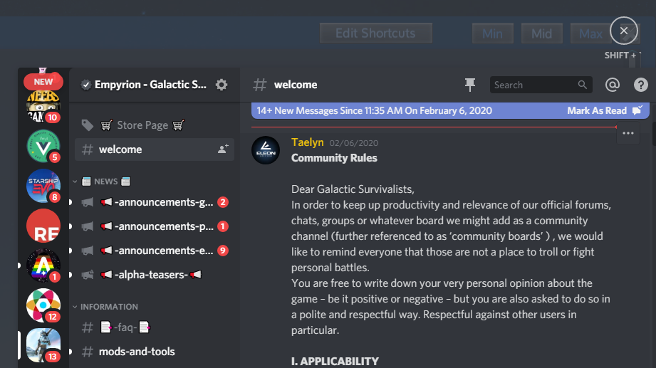
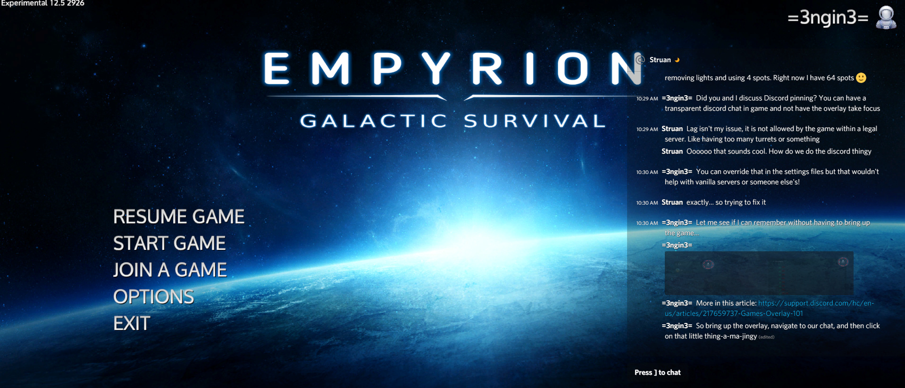

# Games Overlay Pinning

Activate the Discord overlay with `Shift + ~`.

Then click on the pin.

At this point, the opacity control becomes available.

Use the slider to control the degree of transparency.

Now you may continue to chat while playing by using the `[` key. However, the overlay no longer takes over the focus.

## References

1. [Games Overlay 101](https://support.discord.com/hc/en-us/articles/217659737-Games-Overlay-101)
